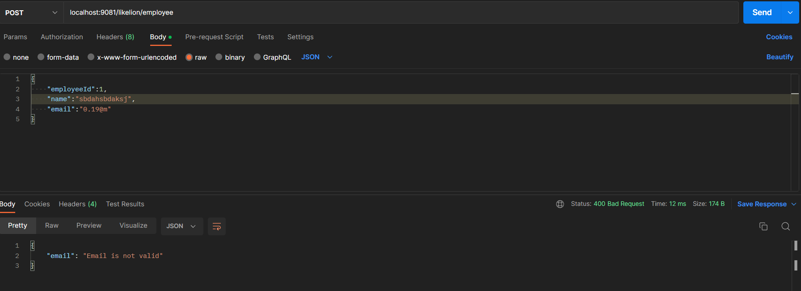
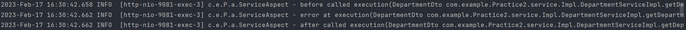

## :fire: Main contents:
<!-- TABLE OF CONTENTS -->

  
Table of Contents

  <ol>
    <li><a href="#task-1">Task 1</a></li>
    <li><a href="#task-2">Task 2</a></li>
    <li><a href="#task-3">Task 3</a></li>
    <li><a href="#task-4">Task 4</a></li>
  </ol>

# This is my project
## Task 1
### application.properties

## Task 2
### EmployeeDTO

### DepartmentDTO

### Create error and call

## Task 3
### Call request to service

## Task 4
### Code Filter

### Result

