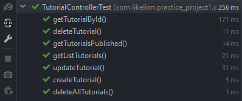

# Practice Week8-3

## Task1: Code CRUD, Service, Controller for Entity

## Task2: Write Test Case for 3 Layer

### Repository Layer

### Service Layer

### Controller Layer

## Task 3: Actuator
### File application.properties

### View All Endpoint

### View Health Of application

### Shutdown App by Spring Actuator

## Task 4: Devtools
### File application.properties

### Change manage port

### View All Endpoint

