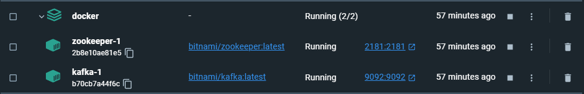
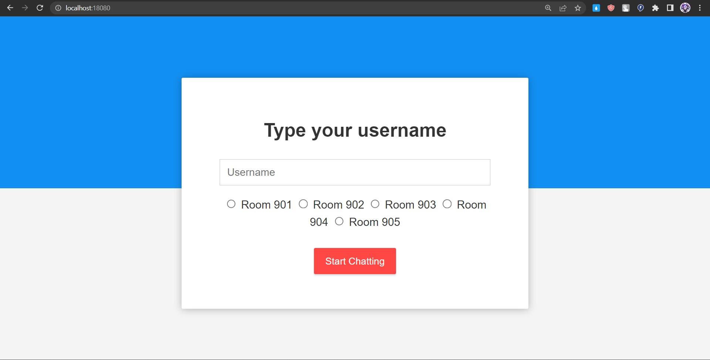
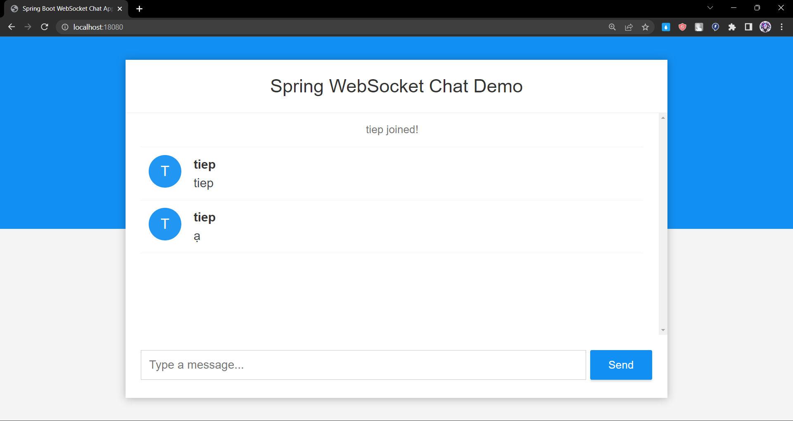
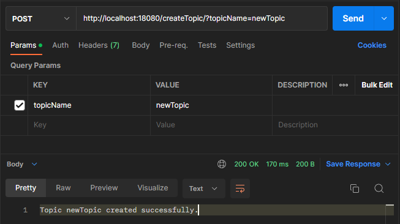
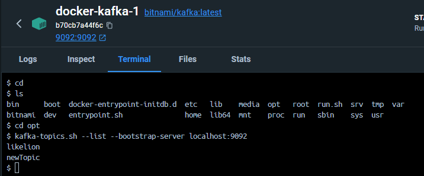

# Chat Application
A realtime chat application built using Websocket, Redis as Cache and Kafka as MessageBroker
## Before Running the Project
To use Apache Kafka in a development setup
```shell
docker-compose up -d
```
by using a Docker Compose file
```dockerfile
version: "3"
name: kafka-zookeeper
services:
  zookeeper:
    container_name: zookeeper
    image: 'bitnami/zookeeper:latest'
    ports:
      - '2181:2181'
    environment:
      - ALLOW_ANONYMOUS_LOGIN=yes
  kafka:
    container_name: kafka
    image: 'bitnami/kafka:latest'
    ports:
      - '9092:9092'
    environment:
      - KAFKA_BROKER_ID=1
      - KAFKA_CFG_LISTENERS=PLAINTEXT://:9092
      - KAFKA_CFG_ADVERTISED_LISTENERS=PLAINTEXT://127.0.0.1:9092
      - KAFKA_CFG_ZOOKEEPER_CONNECT=zookeeper:2181
      - ALLOW_PLAINTEXT_LISTENER=yes
    depends_on:
      - zookeeper
```
Its compose in Docker Container



#### Demo Project
* Realtime chat webapp demo



* Kafka listener in each message




#### Build chat webapp as Docker Image
```dockerfile
FROM maslick/minimalka:jdk11
VOLUME /tmp
ARG JAR_FILE=target/*.jar
COPY ${JAR_FILE} app.jar
ENTRYPOINT ["java", "-jar", "/app.jar"]
```

* run `mvn clean package`
* run `docker build -t chat-app .` to build image
* run `docker image ls` to check the newly built image
* run `docker run --name chat-app -p 18080:18080 chat-app` to create `chat-app` container & run image


#### Dynamic topic

###### KafkaDynamicTopic
```java
@Configuration
public class KafkaDynamicTopic {
    @Value("${spring.kafka.bootstrap-servers}")
    private String bootstrapServers;
    private Properties props = new Properties();

    @Bean
    public Properties DynamicTopicConfig(){
        props.put(AdminClientConfig.BOOTSTRAP_SERVERS_CONFIG, bootstrapServers);
        return props;
    }
    public void createTopicDynamic(String newTopic) {
        try {
            AdminClient adminClient = AdminClient.create(props);
            NewTopic topic = new NewTopic(newTopic, Collections.emptyMap());
            adminClient.createTopics(Collections.singletonList(topic)).all().get();
        }
        catch (ExecutionException | InterruptedException e){
            if (e.getCause() instanceof TopicExistsException) {
                System.out.println("Topic already exists");
            } else {
                e.printStackTrace();
            }
        }
    }
    public void deleteTopicDynamic(String oldTopic){
        try {
            AdminClient adminClient = AdminClient.create(props);
            adminClient.deleteTopics(Collections.singletonList(oldTopic)).all().get();
        }
        catch (ExecutionException | InterruptedException e){
            if (e.getCause() instanceof TopicExistsException) {
                System.out.println("Topic already exists");
            } else {
                e.printStackTrace();
            }
        }
    }
}
```
###### TopicController
```java
@RestController

public class TopicController {
    @Autowired
    private KafkaDynamicTopic kafkaDynamicTopic;
    @PostMapping("createTopic")
    public ResponseEntity<String> createTopic(@RequestParam String topicName){
        kafkaDynamicTopic.createTopicDynamic(topicName);
        return ResponseEntity.ok("Topic " + topicName + " created successfully.");
    }
}

```
#### Create new topic 
* Using postman

* Check in docker


